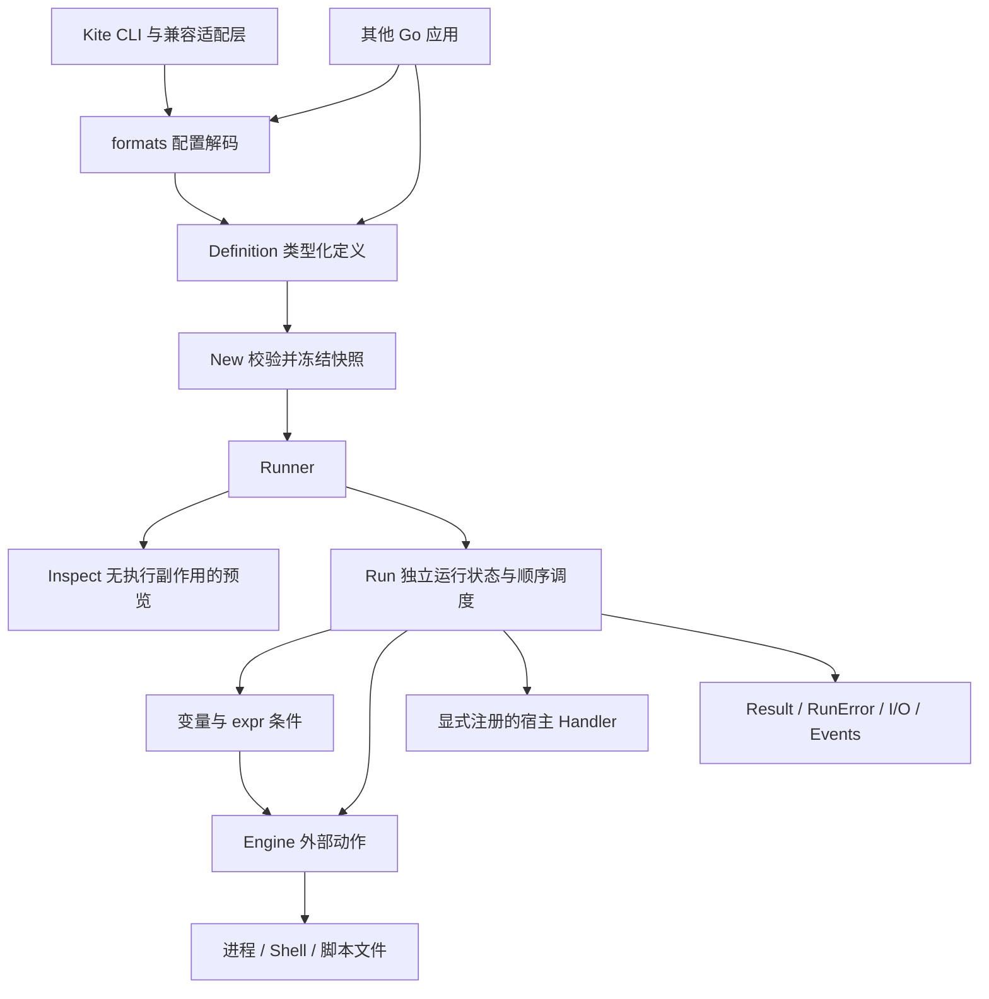

<!-- template_id: design; template_version: 1.1.1 -->
# github.com/gookit/taskrun 独立任务脚本库设计

> 状态：Draft 0.3 / 待设计批准
>
> 模块路径：`github.com/gookit/taskrun`；主包名：`taskrun`。
> 文档日期：2026-09-15；文档版本与未来 Go module 发布版本分别管理。
> standards_binding: BOUND；工作区 `D:/work/inhere/my-tools-dev` 已绑定 IDEV-STD 0.19.0，profile=`go-tools`，revision=`9dc4a010355e1eb7a5c53f99558495df09eb9553`；使用 inhere-doc-workflow design 合同与模板 1.1.1。绑定验证通过不等于设计已获人工批准。

## 修订记录

| 版本 | 日期 | 作者 | 摘要 |
|---|---|---|---|
| 0.1 | 2026-09-15 | Codex | 建立独立库定位、公共 API、执行语义、Kite 兼容边界、分期范围和验收条件 |
| 0.2 | 2026-09-15 | Codex | 绑定工作区 IDEV-STD；将 Go 基线改为 1.23+；把脚本定义条件判断纳入首期契约 |
| 0.3 | 2026-09-21 | Codex | 按用户决定将模块路径改为 `github.com/gookit/taskrun`（主包 `taskrun`），并同步 D01：`kscript` 的 k 是 Kite 遗留前缀，且与 kite-go 旧包 `pkg/kscript` 同名会导致 import 别名 |
| 0.4 | 2026-09-21 | Codex | 按 CI 实测（GitHub Actions Windows runner 拒绝嵌套 Job Object）修订取消/清理契约：默认 `TreeKillAuto` 在拥有机制不可用时退化为按父进程链终止整棵树，`TreeKillRequired` 保留严格失败语义（新增 D11） |

仅在目标、范围、接口、行为、验收等语义变化时递增文档版本；状态与来源信息纠正不新增修订。

## 背景与目标

Kite 已有 `pkg/kscript`，另一个 Go 应用也需要任务与脚本执行能力。继续通过 `github.com/inhere/kite-go/pkg/kscript` 引用，会使消费者受 Kite 模块的依赖图、版本节奏和 CLI 行为约束。本设计将其抽为可以独立发布、测试和嵌入的 Go 库。

用户已确认模块路径 `github.com/gookit/taskrun`，以及“抽离 + 完善、供多个 Go 应用使用”的方向。本次授权是编写设计；尚未创建新仓库、移动源码、改变依赖或发布版本。

目标使用结果：

1. 普通 Go 应用可以通过一个主包构造任务、运行外部命令或脚本文件，获取结构化结果，无需初始化 Kite 或 CLI 框架。
2. 使用配置文件的应用可以显式加载 YAML/JSON/TOML，获得与 Go API 相同的任务模型与校验语义。
3. CLI 应用可以绑定终端输入输出；服务应用可以使用独立工作目录、请求上下文和有界输出收集。
4. 同一个 Runner 可以被多个请求同时调用；请求间不共享可变变量、环境、输出和任务状态。
5. Kite 通过适配层继续使用旧任务文件和应用变量，命令 alias、扩展与系统命令分发由 Kite 保持所有权。

### 设计工作声明

| 项目 | 声明 |
|---|---|
| thinking_mode | RIGOROUS |
| core_objective | 设计可独立引入的 taskrun 库，覆盖抽离、可靠执行与两类应用接入 |
| scope freeze | 公共契约、格式边界、任务/脚本执行、Kite 迁移及验收 |
| expansion_policy | DEFER_OR_REQUEST；新增语言 VM、调度服务、远程执行等进入后续候选 |
| review budget | 本轮一次源码核对与一次文档一致性自检；无核心矛盾即交付 Draft；正式独立评审另行安排 |
| stop condition | 草稿、来源链接、静态检查完成后交付；不自动进入实施计划或代码实施 |
| delivery track | 按跨应用公共 API 变更考虑 Full；此项为设计复杂度判断，不是 UNBOUND 下的中央审批结论 |

## 名词

| 名词 | 定义 |
|---|---|
| Definition | 一组任务、默认配置、脚本文件和来源信息；是加载后的数据模型 |
| Task | 有名称、描述、参数、依赖、条件和顺序 Steps 的工作单元 |
| Step | Task 内的一个动作，明确区分进程、Shell、脚本文件、任务调用和宿主函数 |
| Dependency | 在父任务 Steps 前运行的前置任务；首期顺序执行 |
| Task call | Steps 中明确调用另一个任务，保留调用顺序和每次调用的副作用 |
| Runner | 持有经过验证的定义快照与后端配置，按请求创建独立执行状态 |
| Request | 一次执行的任务名、参数、变量、环境、工作目录和 I/O 配置 |
| Engine | 执行已准备好的外部动作；不负责加载任务或递归调度 |
| Handler | 宿主显式注册的 Go 函数；供任务调用已有应用能力 |
| Result / RunError | 结构化执行结果和可分类错误；结果保留每个任务与步骤的状态 |
| Inspect / Dry-run | 生成执行预览而不调用进程、宿主 Handler 或动态变量命令 |

## 范围与非目标

### 所有权与文档位置

- 核心库归属拟建模块 `github.com/gookit/taskrun`。
- 现有消费者为 `github.com/inhere/kite-go`；第二个 Go 应用的项目路径、Go 最低版本和使用场景尚未提供。
- 当前 `my-tools-dev` 与 `inhere-tools` 目录不是 Git 根，目标库也尚未落地。按范围未完全确定时优先项目级位置的约定，设计暂存在 Kite Git 仓库 `docs/design/`，作为抽离来源项目的设计。
- 新库正式落地后，可将此设计迁入新库文档并在 Kite 保留指向；避免维护两个同时生效的设计副本。本轮不创建目标仓库或更改其他项目。

### 首期拟定交付：v0.1

| 范围 | 交付语义 |
|---|---|
| 独立引入 | 独立 go.mod、MIT 来源保留、主包公开 API、英文 README 与中文 README.zh-CN.md |
| 任务输入 | Go 类型化定义、配置解码、显式来源合并、稳定列表与精确查找 |
| 基础执行 | argv 进程、显式 Shell、显式注册的脚本文件、宿主 Handler |
| 任务关系 | 顺序 deps、顺序 task call、预检缺失引用和循环、每次调用独立状态 |
| 配置和表达式 | 明确变量/环境/目录优先级、expr 布尔条件、受统一执行规则管理的动态变量命令 |
| 生命周期 | context 取消、任务与步骤超时、运行实例隔离、子进程清理契约 |
| 可观察结果 | 结构化状态与错误、可注入 I/O、可选有界输出收集、无执行副作用的预览 |
| Kite 接入 | 旧格式转换、旧发现规则、变量注入、CLI 输出与外层分发适配 |
| 复用证明 | Kite 接入验证和独立 consumer 示例；第二个真实应用接入是单独验收项 |

### 后续候选与非目标

- v0.2 候选：有界依赖并行、显式去重策略、有限重试；在共享依赖和副作用语义确定后设计，不作为 v0.1 完成条件。
- 以后按需求评估：Taskfile 子集转换、mvdan/sh 后端、增量构建缓存、更多结果解码器。
- 暂不纳入：完整 Taskfile/justfile 兼容、Just 运行时依赖、通用脚本语言设计、Goja/Tengo/Starlark VM 集成、ScriptApp 自动生成 CLI。
- 不提供分布式调度、cron、持久队列、远程主机执行、容器管理、发布/回滚系统。
- 不承诺仅靠 Go 库隔离任意不可信脚本；宿主可在进程/容器边界设置权限与资源约束。

## 已确认事实与规范

### 源码基线与证据限制

核对日期为 2026-09-15；Kite Git HEAD 为 `21f12689c10d0da618de58f13bc65cd222d65ce3`。本轮核对的是当前工作区源码；不以历史对话或调研笔记代替源码证据。

codebase-memory 项目为 `kite-go`，generation 为 `2026-09-14T15:44:51Z`。使用 Verify 级符号搜索、双向一跳 trace、关键函数 snippet 和路径 coverage。相关文件 coverage 无记录解析缺口，但 freshness 报告 `metadata_changed`，因此已直接读取本节引用的 kscript 源文件和调用方。图中同名 `NewCmd` 等 heuristic 跨包连边不用于判断真实依赖；图结果不作为穷尽调用链证明。

工作区绑定已落地到 `D:/work/inhere/my-tools-dev/standards.json`：`standards_release=0.19.0`、`standards_revision=9dc4a010355e1eb7a5c53f99558495df09eb9553`、profile=`go-tools`、exceptions 为空、local_context 为空。绑定后的 `probe` 返回 `BOUND`，`validate --workspace` 返回 `PASS`，effective modules 包含 `go`、`development`、`router-gates`、`ai-collaboration` 和 `ai-interaction`。原生 `init --apply` 在当前 runtime 对 collection 参数错误地继续返回 `SESSION_VERIFICATION_INVALID`，因此按其已验证 preview 内容写入最小 manifest；未复制或修改中央规范文件，也未声明中央规则审批完成。

### 现状与设计影响

| 已确认事实 | 源码依据 | 对设计的影响 |
|---|---|---|
| kscript Go 文件没有直接导入 Kite internal 包；仍使用 gookit 工具、配置、日志和 CLI 展示依赖 | [runner.go](https://github.com/inhere/kite-go/blob/main/pkg/kscript/runner.go)、[runner_run.go](https://github.com/inhere/kite-go/blob/main/pkg/kscript/runner_run.go)、[type_task.go](https://github.com/inhere/kite-go/blob/main/pkg/kscript/type_task.go)、[types.go](https://github.com/inhere/kite-go/blob/main/pkg/kscript/types.go) 的 import | 抽离基础较好，但需要消除直接打印和可变全局状态；不仅是改 module path |
| 已有字符串、命令数组、结构化 map 等任务形态 | `parseScriptTask`、`LoadFromMap`，[type_task.go](https://github.com/inhere/kite-go/blob/main/pkg/kscript/type_task.go) | 为旧文件提供转换器，新核心只接收统一模型 |
| 已有 deps 顺序递归执行及 @task: 引用 | `runScriptTask`，[runner_run.go](https://github.com/inhere/kite-go/blob/main/pkg/kscript/runner_run.go)；`loadRun`，[type_task.go](https://github.com/inhere/kite-go/blob/main/pkg/kscript/type_task.go) | 首期保留顺序与重复调用行为，新增完整引用校验和循环检测 |
| 已导入 expr；resolveIfExpr 仍 panic、打印且固定返回 true，正常任务执行路径未调用此方法 | `resolveIfExpr` 与 `LoadFromMap`，[type_task.go](https://github.com/inhere/kite-go/blob/main/pkg/kscript/type_task.go)；`runScriptTask` | expr 是现有依赖，不是首次引入；需要补齐条件字段解析和真实执行语义 |
| 动态变量已有 @sh:/@exec: 执行；发生在普通命令 dry-run 之前 | `resolveDynVars`、`buildTaskRenderVars` | 预览必须禁止动态变量执行；取消、超时和错误处理必须统一 |
| 存在包级可变 renderer，递归任务共用并修改 RunCtx，EnvPaths 和变量也会被执行过程修改 | `rpl`、`runScriptTask`、`svRender`、`ParseVarInEnv` | 库化时必须按 Run/Task/Step 建立独立状态，不能声明现状已并发安全 |
| Shell 执行统一使用 shell -c；脚本 .go 映射是字符串 go run | `runScriptTask`、`runScriptFile`，[kscript.go](https://github.com/inhere/kite-go/blob/main/pkg/kscript/kscript.go) | Windows Shell 参数和解释器前置参数需要结构化表示 |
| 加载完成标记在加载成功前设置；部分错误可被 Run/TryRun 分发路径覆盖 | `LoadScriptTasks`，[runner.go](https://github.com/inhere/kite-go/blob/main/pkg/kscript/runner.go)；`Run`、`TryRun` | 改用先构造、验证、再发布完整快照，严格区分未找到与加载/执行错误 |
| 自动发现会逐层查找、每层最多取一个匹配文件，收集后逆序处理 | `findAutoTaskFiles`，[runner.go](https://github.com/inhere/kite-go/blob/main/pkg/kscript/runner.go) | 实现并非“找到最近文件就完全停止”；旧发现模式留在 Kite，核心发现默认关闭 |
| Timeout、IgnoreErr、Output、ScriptApp 等字段的存在不代表运行闭环已经完成 | [types.go](https://github.com/inhere/kite-go/blob/main/pkg/kscript/types.go)、`TaskCmd` 及执行循环 | 每个首期公开字段必须有执行语义和验收；未完成的字段不直接复制到公共 API |
| alias、ext、系统命令分发在 cmdbiz；plugin 是 TODO；Kite 变量由 ConfigScriptCtx 注入 | [runany.go](https://github.com/inhere/kite-go/blob/main/internal/biz/cmdbiz/runany.go)、[service.go](https://github.com/inhere/kite-go/blob/main/internal/boot/service.go) | 外层路由和 Kite 命名空间归消费者；不把计划中的 plugin 当作已有功能 |
| 当前 Kite go.mod 为 Go 1.25.0，许可证为 MIT | [go.mod](https://github.com/inhere/kite-go/blob/main/go.mod)、[LICENSE](https://github.com/inhere/kite-go/blob/main/LICENSE) | 新库采用 Go 1.23+ 基线；只选择新库实际需要的依赖，保留原版权声明 |
| 包内现有测试只见一个简短的条件表达式测试 | [runner_test.go](https://github.com/inhere/kite-go/blob/main/pkg/kscript/runner_test.go) | 需要补充行为证据，本设计未声称现有测试通过 |

前述事实修正早期讨论中“没有 deps”“动态变量只有 TODO”“尚未接入 expr”和“plugin 已完成”的表述。配置兼容应以可验证执行行为为准，而非所有已声明字段。

### 与 Task、Just 和现成库的关系

| 对象 | 本设计取舍 | 一手入口 |
|---|---|---|
| go-task/task | 借鉴声明式任务、依赖、状态模型；不依赖其内部实现，不承诺 Taskfile 兼容 | [仓库](https://github.com/go-task/task)、[文档](https://taskfile.dev/docs/) |
| casey/just | 借鉴简单命令配方、参数和清晰输出；不作为 Go module 依赖 | [仓库](https://github.com/casey/just)、[手册](https://just.systems/man/en/) |
| expr-lang/expr | 沿用现有表达式依赖并封装编译/布尔求值；不将其当模板或任务执行器 | [仓库](https://github.com/expr-lang/expr) |
| mvdan/sh | 后续可作为可选进程内 Shell 后端；首期以外部解释器为基线，不承诺完整 Bash/Zsh/PowerShell 等价 | [仓库](https://github.com/mvdan/sh)、[interp API](https://pkg.go.dev/mvdan.cc/sh/v3/interp) |

Task 使用 mvdan/sh 的解释执行能力，不能笼统描述成“必须安装系统 Shell”；外部命令仍需要实际可执行文件。这里比较的是产品定位和接入边界，不使用未经锁定版本验证的 API 稳定性、Go 最低版本或 Stars 作为设计依据。

## 总体方案

### 核心原则

1. 主包提供少量完整能力：构造、校验、查找、预览、运行。消费者不必组装 Loader/Resolver/Scheduler 等多个框架对象才能使用。
2. Definition 在 New 时校验并复制成私有快照；Runner 的配置在构造后不可变。重载通过创建新 Runner 并由宿主替换引用完成。
3. 公开可注入的边界为动作 Engine、宿主 Handler、I/O 和事件观察器；首期不为每个内部函数创建公共接口。
4. Load、New、Lookup、List、Inspect 不执行命令。运行副作用只有 Run 下的显式动作和动态变量求值可以产生。
5. 精确任务名/别名查找与模糊搜索分离；核心 Run 不根据字符串猜测 alias、系统命令或脚本语言。
6. argv 与 Shell 源码具有不同契约；变量值不能被隐式重新分词或转换成 Shell 语法。
7. 对无效配置、缺失任务和执行失败返回 error；不 os.Exit、不通过日志代替返回错误、不把条件错误转成成功。

### 统一动作模型

每个 Step 必须且只能选择一种动作；Task 定义引用静态已知的任务名，便于预检所有调用边。

| 动作 | 定义 | 执行者 |
|---|---|---|
| exec | Program + Args，直接启动可执行程序 | 默认进程 Engine |
| shell | 显式 Shell 名和完整源码；不自动补默认 Shell | 默认进程 Engine 的 Shell 适配器 |
| file | 引用显式注册的 ScriptFile 名，带参数；解释器使用 Program + PrefixArgs | 默认进程 Engine |
| task | 顺序调用另一个 Task，参数可显式传递或继承 | Runner 内部执行器 |
| host | 引用构造时注册的 Handler 名，参数为数据 | Runner 的 Handler 分发 |

首期允许只有 deps 而没有 Steps 的聚合任务；deps 和 Steps 均为空且没有有意义的条件时拒绝空任务。宿主函数仅通过 host 动作调用；序列化配置不能自行加载 Go 包或注册可执行函数。

### 配置和类型共用语义

新格式显式声明 `version: 1`，将任务放在 `tasks`，脚本文件放在 `files`。版本为配置 schema 版本，独立于 Go module SemVer。JSON/YAML/TOML 仅承担解码，统一经过同一校验路径。

```yaml
version: 1
vars:
  target: ./...
tasks:
  check:
    desc: 检查项目
    deps: [test]
    steps:
      - exec:
          program: go
          args: [vet, "${vars.target}"]
  test:
    steps:
      - exec:
          program: go
          args: [test, "${vars.target}"]
  inspect-env:
    if: vars.enabled == true
    vars:
      enabled: true
    steps:
      - shell:
          name: sh
          script: 'printf "%s\n" "$KS_LABEL"'
        env:
          KS_LABEL: "${vars.target}"
  generate:
    steps:
      - file:
          name: generator
          args: [--check]
  host-check:
    steps:
      - host:
          name: app.check
          args: []
files:
  generator:
    path: scripts/generate.go
    interpreter:
      program: go
      prefix_args: [run]
```

上例 host-check 要求宿主注册 app.check，否则 New 校验失败；inspect-env 明确需要 sh，可由不同平台覆盖配置选择 pwsh。不会宣称同一 Shell 源码天然跨平台。

新格式的字符串插值只处理 `${vars.name}`、`${env.NAME}`、`${args.N}`、`${host.name}` 和 `${run.name}` 等显式命名空间；args.N 从 1 开始。不存在的引用报错，`$HOME`、`$@` 等无命名空间 Shell 语法原样保留。`$${` 表示字面量 `${`，单次渲染不递归展开替换结果。

exec 的每个 Args 元素独立插值并保留为一个参数；追加原始请求参数必须用显式 `forward_args: true`，而不是把数组拼接进一个模板字符串。Shell 模式建议通过 Env 传递数据；在 script 内使用显式模板即表示作者选择源码插值，不提供跨 Shell 通用自动引号保证。旧 `$@/$*/$1` 语义仅在 Kite 兼容转换器内按所选后端处理。

## 架构



### 包结构建议

```text
github.com/gookit/taskrun
├── go.mod
├── taskrun.go         # New、公共选项与类型
├── definition.go      # Definition、Task、Step、File 与校验入口
├── runner.go          # Lookup、List、Inspect、Run
├── request.go         # Request、IO、HostData
├── result.go          # Result、状态、错误与事件
├── engine.go          # Engine 和宿主 Handler 契约
├── internal/
│   ├── graph/         # 引用与循环检查，首期顺序展开
│   ├── render/        # 无共享可变状态的模板与表达式处理
│   └── process/       # argv、Shell 适配、取消和进程清理
├── formats/           # YAML/JSON/TOML、显式来源合并和可选发现
├── examples/
│   ├── basic/         # 只导入主包
│   ├── config/        # 从配置加载
│   └── host/          # Go Handler 接入
├── README.md          # 英文
└── README.zh-CN.md    # 中文
```

主包不导入 formats；formats 导入主包的数据类型，从而避免循环依赖。少量辅助纯函数可继续复用 goutil，但不把 goutil/cmdr 类型泄露为公共 API。配置驱动独立于执行核心；移除库内 gcli、cliui/show、颜色输出和全局日志配置。诊断默认关闭，通过事件回调接入宿主日志。

首期一个 module 足够，不为了隔离子包创建多个版本体系。未来较重的可选 VM 是否独立子模块，要按实际依赖和 Go 版本要求决定；仅拆子包或使用 build tag 并不保证 module 依赖图隔离。

### 公共 API 草案

以下是拟定签名，用于审查职责和调用关系，不代表这些 API 已存在。实现计划可以完善字段，但不能无说明地改变本节语义。

```go
func New(def Definition, opts ...Option) (*Runner, error)

func (r *Runner) Lookup(name string) (TaskInfo, error)
func (r *Runner) List() []TaskInfo
func (r *Runner) Inspect(req Request) (Plan, error)
func (r *Runner) Run(ctx context.Context, req Request) (*Result, error)

type Request struct {
    Task     string
    Args     []string
    Vars     map[string]any
    Env      map[string]string
    HostData map[string]any
    Dir      string
    DryRun   bool
    IO       IO
}

type IO struct {
    Stdin        io.Reader
    Stdout       io.Writer
    Stderr       io.Writer
    CaptureLimit int64 // 每流上限，0 表示不收集，禁止负数表示无界
}

type Engine interface {
    Execute(ctx context.Context, action PreparedAction, streams IO) (ActionResult, error)
}

type Handler func(context.Context, HostCall) (ActionResult, error)
```

- `Definition` 包含 `BaseDir string`、`Tasks map[string]Task`、`Files map[string]ScriptFile` 和默认值；TaskInfo 是只读信息副本。
- `PreparedAction` 是已校验、完成目录/环境/参数解析的 exec、shell 或 file 动作；不包含 task/host，也不允许 Engine 再次调度任务。
- `WithEngine` 替换整个外部动作后端；默认 Engine 使用系统进程。后端需遵守取消和结果契约，不在此层暴露动态注册语言框架。
- `WithHandler(name, fn)` 在 New 前配置宿主能力；New 后不可注册或替换。配置中的未知 Handler 一律报错。
- `HostCall` 携带独立的 Args、Vars、Env、Dir、IO；Handler 主动消费 context 并返回错误。Go goroutine 不能被强制终止，宿主 Handler 的取消保证以协作为边界。
- `WithObserver` 观察事件；回调不改变调度决定，不提供错误返回值。默认无观察器；同一次 Run 顺序回调，不同 Run 可能并发回调，宿主自行同步且应快速返回。
- `WithBaseEnv` 设置 Runner 的环境基线快照；默认 New 时复制 os.Environ，Run 不重新读取进程环境。
- `New` 不默认搜索磁盘或启动命令。`Definition.BaseDir` 必须是绝对路径，显式排除依赖进程 cwd 的隐式行为。
- Request 的 Vars/HostData 只接受可复制的数据值：标量、数组和字符串键 map；拒绝函数、任意对象指针、带副作用方法和循环数据。宿主函数走 Handler。
- 同一次 Run 进入时复制输入；消费者不能在复制期间并发修改同一 map。执行内部不回写调用者数据。

### 最小嵌入示例

```go
package main

import (
    "context"
    "log"
    "os"

    "github.com/gookit/taskrun"
)

func main() {
    dir, err := os.Getwd()
    if err != nil {
        log.Fatal(err)
    }
    runner, err := taskrun.New(taskrun.Definition{
        BaseDir: dir,
        Tasks: map[string]taskrun.Task{
            "check": {
                Steps: []taskrun.Step{
                    {Exec: &taskrun.ExecSpec{Program: "go", Args: []string{"version"}}},
                },
            },
        },
    })
    if err != nil {
        log.Fatal(err)
    }
    result, err := runner.Run(context.Background(), taskrun.Request{
        Task: "check",
        IO: taskrun.IO{Stdout: os.Stdout, Stderr: os.Stderr},
    })
    if err != nil {
        log.Fatal(err)
    }
    log.Printf("status=%s", result.Status)
}
```

示例中的 log.Fatal 是消费者行为；taskrun 本身不终止进程。正式实现后，这个示例必须放在独立临时 module 中以真实版本验证，不能仅凭示意代码认定可用。

## 关键流程

### 加载、合并和命名

1. 主包接受类型化 Definition。formats 从显式文件或 reader 解码为同一类型；reader 必须附 Source 名和绝对 BaseDir。embed.FS 可由宿主打开 reader；脚本执行路径仍是实际文件系统路径，库不自动解包资源。
2. 默认不遍历父目录、不读用户全局配置、不访问网络。发现由调用者显式启用并指定 StartDir、StopDir、最大层数、名称和扩展优先顺序。
3. `nearest` 模式遇到第一层匹配即停止；`ancestors` 模式逐层收集、根到近层加载，每层最多选择一份。抵达文件系统根、StopDir 或最大深度即停止，避免 Windows 盘根重复。
4. 单文件重复 key、未知字段和多种动作混填均报错。多个 Source 按传入顺序合并：默认冲突报错；显式启用 Override 时后者整条替换同名 Task，不做隐式字段深合并。来源默认 Vars/Env 按键覆盖，记录最终来源。
5. 任务名称和别名共享名称空间，冲突报错；脚本文件使用独立注册表，只能由 file 动作调用。List 按任务名稳定排序；Lookup/Run 只做精确匹配。
6. 解析成功后才 New；New 校验全部任务和文件引用、表达式语法、Handler 名以及所有 deps/task call 边。失败不发布半成品 Runner。

### 变量、目录和环境

| 内容 | 从低到高的优先级或规则 |
|---|---|
| Vars | Definition 默认值 → 当前 Task → 当前 Step → Request.Vars；动态变量与静态变量同层，重复键报错。各层自下而上解析：Definition 默认值在合并 Request.Vars 之前渲染，因此不能引用请求变量（引用报 `invalid_definition: unknown variable`）；Task/Step 层可引用 Definition 与 Request 变量 |
| HostData | 只读 `${host.*}`，不会被任务配置覆盖；Kite 将 gvs/paths/kite 放在此域 |
| Env | Runner BaseEnv → Definition 默认值 → Task.Env → Step.Env → Request.Env；最后解析 EnvPaths |
| CleanEnv | 当前 Task 的 CleanEnv 为 true 时只去掉 BaseEnv，显式 Env 仍保留；不更改宿主进程环境 |
| PATH | 在最终有效 PATH 上按 Step → Task → Definition 顺序前置目录；尊重平台列表分隔符，Windows key 比较不区分大小写 |
| 工作目录 | Request.Dir 非空时作为本次运行基准；否则使用 Definition.BaseDir。Task.Dir 相对运行基准，Step.Dir 相对有效 Task.Dir；绝对路径保持绝对 |
| 文件路径 | ScriptFile.Path 在加载时相对它的 Source.BaseDir 固定为绝对路径；不受请求工作目录改变 |
| 参数 | Request.Args 保持数组；deps 与未指定 args 的 task call 继承当前调用参数；显式 args（包括空数组）替换继承值 |

不调用 os.Chdir/os.Setenv 修改进程全局状态。参数名和 required/default 验证优先于任何副作用；缺少 `${args.3}` 不能用“只出现了一个参数占位符”判为一个参数即可。

静态变量依赖按引用拓扑求值，未知引用或循环报错；不会依赖 Go map 迭代顺序。Env 在静态变量后渲染，动态变量不能决定进程 Env 或工作目录，避免动态命令需要先知道自身 Env 的循环。`${run.dir}` 等运行元数据为只读；字段验证禁止目录递归引用自身。

动态变量使用单独的 `dynamic_vars` 结构声明 exec/shell/file 命令，普通 Vars 字符串中的 `@sh:` 不触发执行。它们在实际使用前、每个 Task 调用或 Step 内最多求值一次；不跨调用缓存；走相同 Engine、context、输出限制和错误链，stdout 去掉末尾换行形成字符串。超过输出上限报错，不用被截断值继续渲染。

条件使用 expr，空条件表示 true，非空必须返回 bool。任务定义和每个 Step 都可以声明 `if`，也可以使用平台条件；任务条件在 deps 之前求值，false 时跳过该任务及其 Steps，Step 条件在该 Step 的动态变量之后、Engine 之前求值，false 时只跳过当前 Step。编译错误、类型错误和运行错误为失败。条件只能读取本次调用的只读 Vars、Env、Args、HostData 和运行元数据，不能调用任意 Go 方法；如果条件需要动态命令结果，必须显式声明 dynamic_vars，并在真实 Run 中产生可观察求值。Inspect 一律不做动态求值，并将其标为 Deferred。

### 依赖和任务调用


- 首期 deps 和 task call 都串行，最大并行度固定为 1；不同 Run 可以并发。
- deps 和 task call 的静态边都参与循环检测，即便边位于条件 false 的任务中也不绕过；返回完整环路径。额外设置调用深度与最大展开调用数，防止无环但膨胀的配置耗尽资源。
- 首期按出现次数执行，不默默去重。A 依赖 B、C，而 B/C 都依赖 D，则 D 执行两次；连续两次 task call 也执行两次。这保留当前递归行为，并明确将“去重依赖”作为未来可选语义变更。
- 每次调用有独立 CallID、参数、Task Vars/Env 和 deadline；子任务以全局默认值与 Request 为基准重新组合自身配置，不继承父任务的局部 Vars/Env。子任务输出和变量不回写父任务。
- Task 平台不匹配或条件 false 时跳过该 Task 整个子图；依赖任务 Skipped 视为前置已完成，允许父任务继续；失败/取消则阻断父任务。
- 任务内部 Steps 串行；Step 的 ignore_error 仅能容忍正常执行后的非零退出码或 Handler 业务错误，记录 IgnoredFailure 并继续。不能容忍配置、缺失引用、取消、超时或输出上限错误。
- 不隐式重试任何失败动作；未来 Retry 要求显式次数和幂等语义，避免重复部署或其他副作用。

### 进程、Shell 与文件执行

| 类型 | 默认适配方式 |
|---|---|
| exec | executable + argv；不解析管道、重定向、通配符或 && |
| sh/bash/zsh | 明确解释器 + -c + 源码；不统一假定所有解释器都用此参数 |
| cmd | cmd.exe /D /S /C + 源码，按 Windows 命令行规则单独验证 |
| pwsh | pwsh -NoLogo -NoProfile -NonInteractive -Command + 源码；PowerShell 错误与退出码按其自身语义处理 |
| file | 显式 Interpreter.Program + PrefixArgs + 文件绝对路径 + 参数；例如 go + [run]，不将 go run 作为可执行文件名 |

默认不解析脚本文件中的任意注释元数据或依靠 ShellBang 自动选择解释器。扩展名到解释器的便捷注册可以提供，但结果必须归一化为明确 Interpreter；未知扩展或缺少解释器报错，不靠字符串猜测。

解释器和 Program 查找使用本次有效环境及 PATH；不因修改子进程环境而假定 Go 的默认 LookPath 自动采用相同 PATH。查找失败返回可分类启动错误。dry-run 预览可以显示将选择的解释器，但不得通过启动它来探测功能。

### 取消、超时、输出与状态

- Root context 覆盖整个 Run；Task.Timeout 覆盖该次调用的动态变量、deps 和 Steps；Step.Timeout 覆盖该步求值和执行。有效截止时间为父 context 与局部预算中的最早值；0 表示沿用父预算，负值非法。
- 默认进程后端必须在取消后停止调度、终止所拥有的进程并等待回收。POSIX 采用进程组，Windows 采用 Job Object 或等价已验证实现；若要求的子进程清理能力不可用，应在启动前返回明确错误，不能静默降为只杀父进程。
  - 0.4 修订：Windows 上"拥有机制不可用"包含嵌套 Job Object 被拒（受限宿主，例如 GitHub Actions 的 Windows runner 已把它自己的 Job 套在步骤进程上，`AssignProcessToJobObject` 返回 Access denied）。此时默认行为不再是直接失败，而是退化为按活动父进程链终止整棵树（`taskkill /T /F /PID`），子孙进程仍被清理，不违反"不得只杀父进程"；需要严格语义的调用方可用 `ProcessEngine{TreeKill: TreeKillRequired}` 保留失败行为。两条路径均有真实执行测试。
- 子进程无限逃逸、权限变更或自行脱离宿主控制不在库可保证范围；终止宽限期和具体平台实现必须在实施阶段验证。
- nil Stdin 表示 EOF，nil Stdout/Stderr 表示丢弃；不自动使用全局终端。库的诊断输出与子进程数据输出分开。
- CaptureLimit 为 0 时仅流式转发，不收集。开启收集后每流有界，普通输出超限截断收集并置 Truncated，但继续排空并转发，避免阻塞；动态变量输出超限则失败。
- 同一 Run 的库内写入序列化，支持 stdout/stderr 指向同一 writer；不同 Run 共用 writer 时由宿主同步。Writer 返回错误时终止该动作并保留 I/O 错误。
- Result 区分 Succeeded、SucceededWithWarnings、Failed、Canceled、TimedOut、Skipped、DryRun。步骤另外记录 IgnoredFailure、启动状态、退出码（未启动时没有退出码）、开始/结束时间和截断信息。
- Run 成功时 error 为 nil；有可容忍错误时返回 SucceededWithWarnings 与完整步骤记录。其他失败返回 RunError，包含 Task/CallID/Step/Source/Kind 并支持 errors.Is/As；保留 context.Canceled/DeadlineExceeded 原因。
- ErrNotFound 仅表示请求的根名称没有找到；依赖缺失是 InvalidDefinition，加载失败是 LoadError。Kite 只能在根 ErrNotFound 时继续系统命令兜底，不能误吞执行错误。

### Inspect 与 dry-run

Inspect(req) 验证参数和静态引用、展开关系并生成 Plan；Request.DryRun 复用此流程返回 DryRun Result。均不运行 Engine、Handler、动态变量命令，也不打开步骤输出文件。

可以求值的纯静态条件标记结果；依赖动态值的条件与字段保留为 Deferred，展示来源与所需动作。预览显示调用顺序、动作类型、目录、环境键和参数结构，不承诺动态值最终结果，也不等价于“实际执行已经成功”。

### Kite 迁移映射

| 当前接口/行为 | 迁移后归属 |
|---|---|
| taskrun.NewRunner + 配置映射 | Kite 读取配置 → 兼容转换 → 新库 New；保留过渡包装，避免 CLI 一次性重写 |
| Scripts 的 string/list/map、__settings | Kite legacy converter，归一化为 Definition；来源和转换警告保留 |
| .kite.task[s] / .kite.script[s] 自动发现 | Kite 显式传入 ancestors 发现策略与原名称，不成为独立库默认值 |
| @task:name | 转为 task Step，保留顺序与重复调用 |
| @sh:/@exec: 动态变量 | 转为 dynamic_vars，纳入统一 Engine 与 dry-run 语义 |
| $@ / $* / $1、类型前缀和裸 @ | 兼容转换器负责后端对应参数语义；裸 @ 历史含 silent 与 ignore-error，转换明确标注 |
| ScriptDirs、AllowedExt、ExtToBinMap | 显式扫描与脚本注册，结构化解释器；未知映射报错 |
| AppendVarsFn / gvs / paths / kite | Kite 建立 Request.HostData；旧变量名字映射由转换器处理 |
| BeforeFn、Verbose、Silent、颜色和表格 | Kite 绑定 Observer/I/O 并渲染，库返回数据 |
| alias / ext / system fallback | 继续由 cmdbiz.RunAny 所有；plugin TODO 不借本次抽离补成新子系统 |
| 缓存、加载标志、全局 renderer | 替换为不可变 Definition 快照及每次运行独立状态 |

兼容目标是已有合法配置的可观察行为，不保留 panic、错误被吞、dry-run 执行动态命令、错误解释器参数等缺陷。对历史未生效字段，一旦新实现让其生效，应产生明确迁移说明与验收，不能当作无行为变化的移动。

## 安全、数据、运维与回滚

### 应用嵌入边界

- 任务定义和 Shell 源码应视为可执行内容；默认不从网络或祖先目录自动获取。服务应用自行决定配置来源、可执行程序和 Handler 注册集合。
- 通过 argv 和 Env 传递用户数据；不能将来自 HTTP 请求的任意字符串直接作为 Shell 源码。core 不把表达式 Env 暴露为带任意方法的宿主对象。
- 事件和错误默认只包含来源、任务、步骤和错误类别，不自动转储所有 Env、HostData 或命令参数。子进程输出是否含敏感信息由消费者的日志/存储策略处理，库不声称自动脱敏所有内容。
- 不在磁盘持久化 Result 或执行历史；I/O writer 由宿主显式提供。首期不提供自动写文件的 output 配置。
- 没有事务式回滚；终止运行不能撤销已经写出的文件或调用过的外部服务。需要补偿的应用使用显式补偿任务并自行授权执行。

### 抽离、版本与回退

| 阶段 | 设计意图 | 进入下一阶段所需证据 |
|---|---|---|
| A 行为基线 | 分类现有有效行为与缺陷，整理旧配置 fixture | 兼容清单、参数/变量/依赖/脚本路径的可观察用例 |
| B 独立内核 | 按本设计实现 module、API、校验、串行执行与结果 | 独立 consumer 编译运行、单元/平台执行测试和 race 检查 |
| C Kite 适配 | 用兼容转换器接入新库，保持外层命令路由 | Kite fixture 前后对照与明确缺陷修复说明 |
| D 第二应用 | 按真实应用的目录、Go 版本、I/O 与取消需求接入 | 第二应用实际启动与执行记录；示例成功不能替代 |
| E 发布准备 | 固定依赖、维护 API/迁移文档和版本 | 发布候选及另行授权；设计批准不等于发布授权 |

这是迁移阶段设计，不是实施任务计划。具体 owner、修改文件、命令和评审 Gate 在设计批准后整理。

采用 SemVer，从 v0.x 明确标注实验 API；v1 稳定后破坏性 API 变更采用 Go module 主版本路径规则。新库首期支持 Go 1.23 及以上版本，CI 至少覆盖 Go 1.23 和当前稳定 Go；不得使用 Go 1.24/1.25 专属 API，除非提供兼容实现。第二应用最低版本确认前不把更高版本兼容性当作已通过。

本地迁移验证可以暂用 go.work 或 replace；正式可复用验收必须在工作区之外的新 module 中以真实可获取版本完成，不能依赖本机绝对路径。创建 GitHub 仓库、推送、打 tag 和发布仍需对应授权。

Kite 迁移前保留独立回退点；失败时退回依赖和适配提交，原任务文件不做破坏性自动重写。不尝试用 Git 回退撤销脚本已经造成的业务副作用。新库复制源码时保留现有 MIT 版权来源并检查新增依赖许可证。

### 可观察验收矩阵

以下为后续实现必须达到的证据，不是本次已执行测试。

| ID | 场景 | 预期结果 |
|---|---|---|
| A01 | 外部空 Go module 只导入主包定义并执行任务 | 不引用 Kite module/CLI 初始化；取得成功 Result |
| A02 | YAML/JSON/TOML 等价任务及未知字段/重复 key | 等价定义相同行为；无效输入在执行前失败且定位 Source |
| A03 | 缺失 deps、deps/call 混合循环、展开超限 | 在启动任何步骤前返回带路径的定义错误 |
| A04 | 菱形依赖和重复 task call | 首期按出现次数顺序运行；状态不相互污染 |
| A05 | 条件 true/false/空/类型错误及平台限制 | 正确执行/跳过/失败；不 panic 或固定 true |
| A06 | 参数含空格、引号、空串、美元符号和 Windows 路径 | exec 保留原始参数边界；Shell 按各自契约验证 |
| A07 | go run / Python 文件、sh、cmd、pwsh | 使用正确解释器与前置参数；缺失程序为启动错误 |
| A08 | vars/env 优先级、CleanEnv、自定义 PATH、动态变量 | 结果符合本设计顺序；宿主环境和 cwd 未改变 |
| A09 | dry-run 含动态变量、host 和有副作用命令 | 副作用计数为 0；动态字段显示 Deferred |
| A10 | 同一 Runner 并发执行不同 Vars/Env/IO | race 检查通过；无串值、日志串写到错误请求或共享 EnvPaths 增长 |
| A11 | 超时/取消任务启动的父子进程 | 停止新步骤、清理所拥有进程、回收后返回正确状态 |
| A12 | 大输出、capture 截断、动态变量超限、writer 失败 | 不无界分配或死锁；截断/失败原因可观察 |
| A13 | 非零退出、ignore_error、取消、未知根任务 | 分类正确；被忽略错误仍留记录；只有根 ErrNotFound 可兜底 |
| A14 | Kite 全局+祖先配置、脚本和应用变量 | 合法旧 fixture 保持行为，修复差异明确记录 |
| A15 | 另一个真实 Go 应用接入 | 给出项目路径、Go 版本和实际执行证据；待消费者确定 |

## 决策

| ID | 状态 | 内容与理由 |
|---|---|---|
| D01 | 用户已确认（2026-09-21 改名） | 模块路径 github.com/gookit/taskrun，支持其他 Go 应用独立引入；原路径 github.com/gookit/kscript 因 k 前缀为 Kite 遗留、且与 kite-go 旧包 `pkg/kscript` 同名而改 |
| D02 | 提案 | 一个主包和 formats 扩展包；内部实现可拆，不提前公开多层调度框架 |
| D03 | 提案 | 类型化 Definition + 不可变 Runner + 每次 Request；适合 CLI 与服务并发使用 |
| D04 | 提案 | 默认系统进程 Engine；显式 argv/Shell/file，保留可替换后端 seam |
| D05 | 提案 | 首期完成可靠顺序 deps/call，不隐式去重；并行、重试和缓存延期 |
| D06 | 提案 | expr 仅处理表达式；任务和 Step 的 `if` 是首期能力；新格式显式命名空间，旧 $ 语义由 Kite 转换 |
| D07 | 提案 | 无副作用加载/预览；动态变量在 Run 中走统一执行、取消与输出限制 |
| D08 | 提案 | Kite 命令分发和旧配置兼容留在 Kite；宿主扩展用显式 Handler |
| D09 | 提案 | 原生 schema version 1；Taskfile/justfile 兼容后续独立设计 |
| D10 | 用户已确认/提案 | 首期支持 Go 1.23+、MIT、v0.x；新库选择最小必要依赖，不复制 Kite go.mod |
| D11 | 提案（2026-09-21，CI 实测驱动） | 子进程清理分层：默认 `TreeKillAuto`（Job Object 优先，被拒则按父进程链终止整棵树，子孙仍被清理）；`TreeKillRequired` 保留严格失败语义。理由：受限宿主（GitHub Actions Windows runner 拒绝嵌套 Job Object）上直接失败会使库不可用，而设计真正禁止的是"只杀父进程" |

## 待确认事项

| 事项 | 本草稿的处理 | 何时必须落实 |
|---|---|---|
| 首期范围是否接受 D02—D10 | 以本设计明确提案供审查，尚未视作批准 | 进入实施计划前 |
| 第二应用项目路径、最低 Go 版本、CLI/服务场景 | 不猜测项目，不增加专属功能；v0.1 用独立 consumer 证明库接口 | 最低版本在 dependency freeze 前；真实接入验收前确认路径 |
| 新库本地目录及 GitHub 仓库状态 | 模块 identity 已定；未检查远端仓库存在性，不推断发布状态 | 创建/移动源码前 |
| Windows 进程树终止所需依赖和详细实现 | 清理契约已定，实施阶段选择并在 Windows 验证 | 发布取消能力前；不以只杀父进程替代 |
| Kite 实际旧任务使用了哪些未生效字段 | 用 fixture 分类；不能默默启用 timeout/ignore-error 等造成行为变化 | Kite 切换前 |

上述事项不阻碍草稿交付；会影响版本基线和实施验收的项目不得在实现中悄悄默认。

## 结论与人工计划 Gate

本设计建议将 taskrun 定位为面向 Go 应用嵌入的任务脚本库：主包提供简单稳定入口，默认外部进程执行，统一定义、上下文、结果和错误，Kite 在边界适配旧格式与命令系统。

首期以“独立可用且可靠”为完成标准，保留已存在的顺序依赖和任务调用，补齐必要的隔离、错误、取消和预览语义。完整构建工具、跨任务并行、语言 VM 和外部格式兼容属于后续候选。

当前仅交付 Draft 0.2。静态 validator 成功只说明文档结构符合选用合同，不代表设计已获批准、实现已验证或人工实施 Gate 已通过。设计批准应明确包含 D02—D10 及首期范围；进入规划或实施仍以用户后续明确请求为准。
